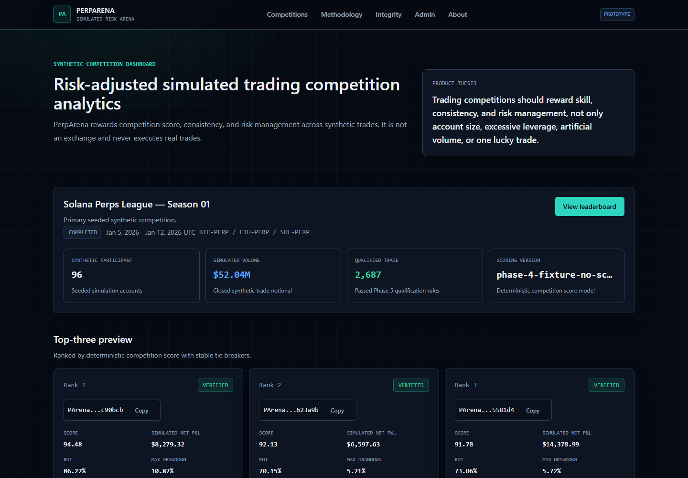
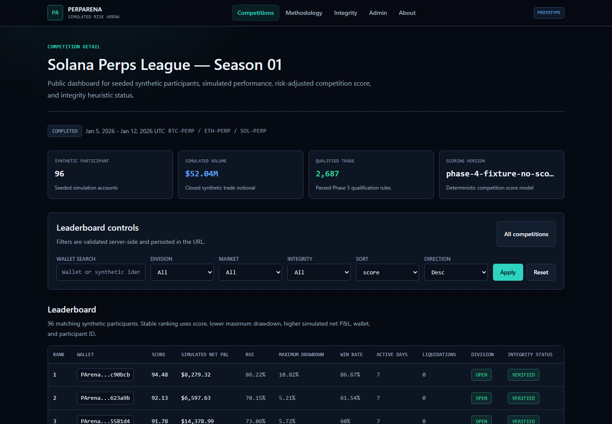
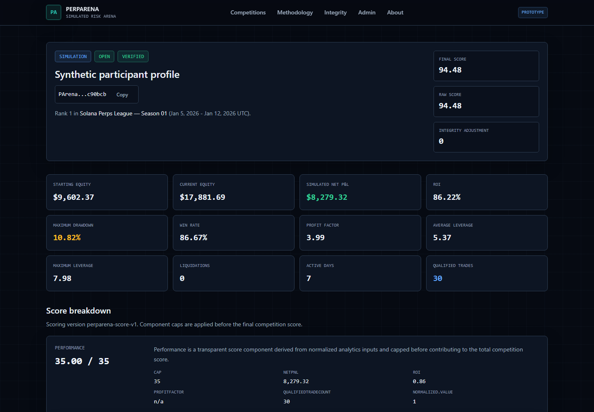
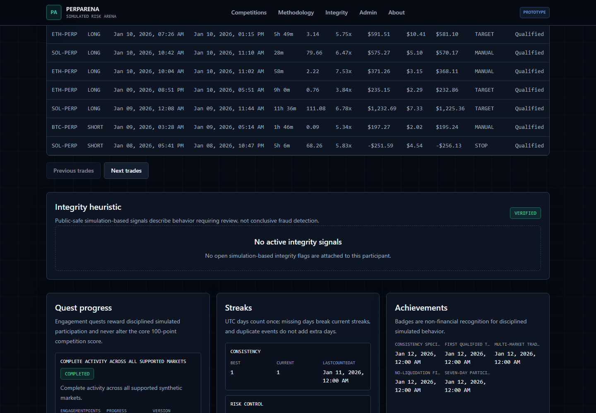
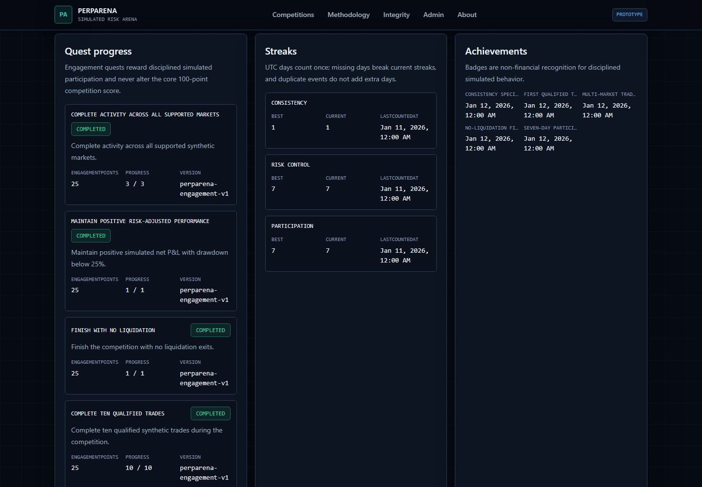
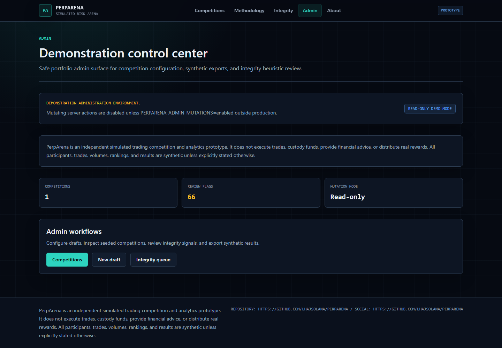
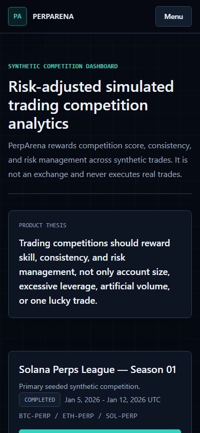
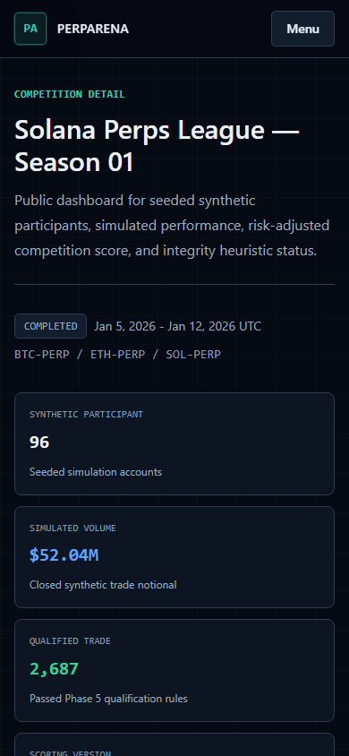
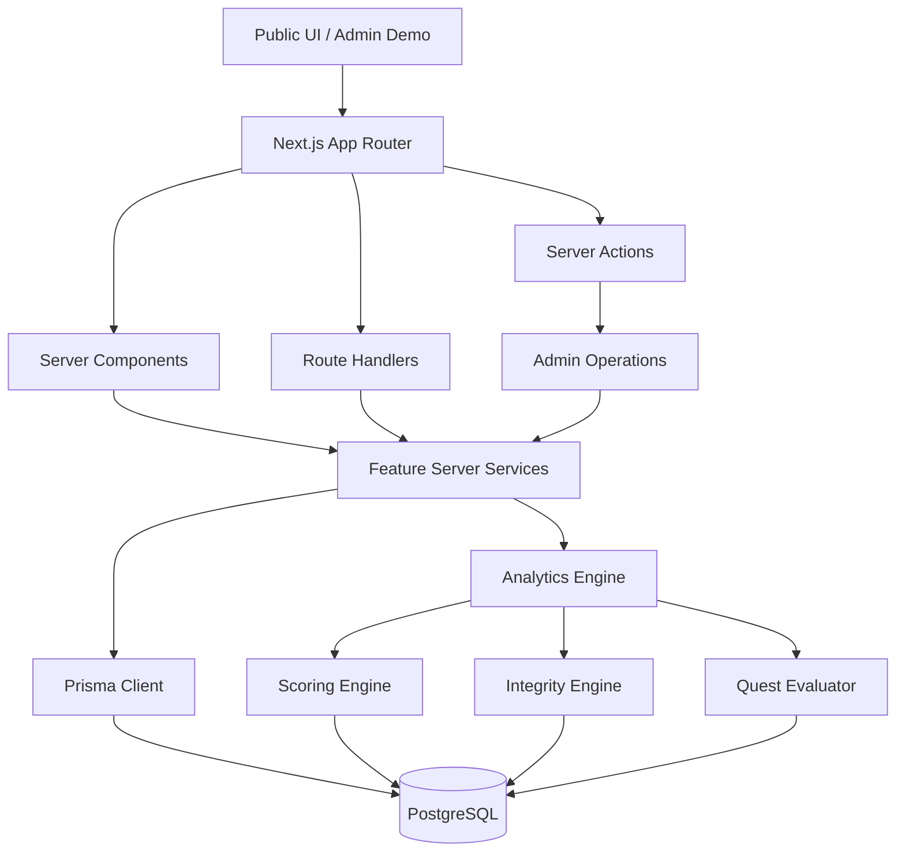

# PerpArena

**PA** - PerpArena

Independent simulated, risk-adjusted trading competition and analytics prototype.

Public demo: **https://perparena.vercel.app**

Deployment: Vercel production deployment from `origin/main`, verified on
2026-07-27.

Repository status: portfolio prototype, active development, not production
financial infrastructure.

## Simulation Disclaimer

PerpArena is an independent simulated trading competition and analytics
prototype. It does not execute trades, custody funds, provide financial advice,
or distribute real rewards. All participants, trades, volumes, rankings, and
results are synthetic unless explicitly stated otherwise.

PerpArena is not affiliated with Adrena, Jupiter, Drift, Jupiter Perps, any
exchange, or any trading protocol.

## Product Thesis

Trading competitions should reward skill, consistency, and risk management, not
only account size, excessive leverage, artificial volume, or one lucky trade.

## Problem

Many trading competition formats over-reward raw account size, extreme leverage,
short bursts of artificial activity, or a single oversized winning trade. That
can make leaderboards noisy and difficult to evaluate.

## Solution

PerpArena simulates a seven-day perpetual-futures-style competition and ranks
synthetic participants using transparent analytics, risk-adjusted scoring,
integrity heuristics, and non-financial engagement mechanics.

## Core Features

- Deterministic synthetic competition generator.
- PostgreSQL and Prisma normalized data model.
- Pure analytics engine for P&L, ROI, drawdown, profit factor, daily returns,
  leverage, market allocation, and trade frequency.
- Transparent 0-100 competition scoring model.
- Explainable integrity heuristic system.
- Public competition dashboard and leaderboard.
- Synthetic trader analytics profiles with charts.
- Quests, streaks, and achievements that avoid reckless-volume incentives.
- Safe demonstration admin control center.
- Validated API boundaries and readiness checks.

## Screenshots

Screenshots were captured from the verified production deployment.


















## Scoring Model

Maximum competition score: 100 points.

- Performance: 35
- Risk management: 25
- Consistency: 20
- Qualified activity: 10
- Market diversity: 10

The model is deterministic and bounded. It does not guarantee perfect fairness
and should be calibrated before any real-world use.

Example with synthetic inputs:

| Component            | Synthetic inputs                                               | Result   |
| -------------------- | -------------------------------------------------------------- | -------- |
| Performance          | 12% ROI, positive net P&L efficiency, 1.8 profit factor        | 25 / 35  |
| Risk management      | 7% maximum drawdown, 3x average leverage, no liquidations      | 21 / 25  |
| Consistency          | 5 active days, 70% profitable active days, moderate volatility | 15 / 20  |
| Qualified activity   | 18 qualified trades across 5 days                              | 8 / 10   |
| Market diversity     | SOL-PERP, BTC-PERP, ETH-PERP with non-trivial allocation       | 8 / 10   |
| Raw total            | Sum of components                                              | 77 / 100 |
| Integrity adjustment | Neutral multiplier                                             | 77 final |

See [docs/scoring.md](docs/scoring.md).

## Integrity Engine

The integrity engine is a heuristic review system, not conclusive fraud
detection. It produces simulation-based flags such as:

- repetitive instant round trips
- excessive leverage
- one-trade score domination
- possible volume farming
- excessive liquidation rate
- abrupt final-hour activity

Public language uses "Integrity heuristic", "Integrity signal", "Behavior
requiring review", and "Simulation-based flag".

See [docs/integrity.md](docs/integrity.md).

## Competition Divisions

- `OPEN`: standard simulated competition participants.
- `PROVISIONAL`: smaller or less active synthetic participants.
- `RISK_LAB`: high-risk or anomaly-heavy simulation profiles.

Divisions are descriptive competition groupings, not accusations.

## Quests and Achievements

Engagement mechanics reward disciplined simulated participation:

- complete qualified trades
- trade supported markets
- maintain low drawdown
- avoid liquidations
- build active-day and no-liquidation streaks

Engagement points do not silently alter the core 100-point score.

See [docs/engagement.md](docs/engagement.md).

## Architecture



See [docs/architecture.md](docs/architecture.md).

## Technology Stack

- Next.js App Router
- React
- TypeScript strict mode
- Tailwind CSS
- Prisma
- PostgreSQL
- Zod
- Vitest
- Playwright
- Recharts
- ESLint
- Prettier

## Data Model

Core models include `Competition`, `CompetitionMarket`,
`CompetitionConfiguration`, `Participant`, `Trade`, `DailyPerformance`,
`ScoreBreakdown`, `LeaderboardSnapshot`, `Quest`, `QuestProgress`, `Streak`,
`Achievement`, `ParticipantAchievement`, and `IntegrityFlag`.

See [docs/data-model.md](docs/data-model.md).

## Local Setup

```bash
npm install
npm run db:generate
npm run dev
```

Database-backed routes require PostgreSQL through `DATABASE_URL`.

## Environment Variables

```bash
DATABASE_URL=
NEXT_PUBLIC_APP_URL=http://localhost:3000
PERPARENA_ADMIN_MUTATIONS=
PERPARENA_ADMIN_TOKEN=
PERPARENA_ALLOW_PRODUCTION_SEED=
```

Do not commit real `.env` files.

## Database Migration

Development:

```bash
npm run db:migrate
```

Production:

```bash
npm run db:migrate:deploy
```

## Seeding

Development seed:

```bash
npm run db:seed
```

Production seed is explicit and non-overwriting:

```bash
PERPARENA_ALLOW_PRODUCTION_SEED=enabled npm run db:seed
```

Then recalculate derived data:

```bash
npm run analytics:recalculate
npm run score:recalculate
npm run integrity:recalculate
npm run engagement:recalculate
```

## Development Commands

```bash
npm run dev
npm run build
npm run lint
npm run typecheck
npm run test
npm run test:e2e
npm run format
npm run format:check
```

## Testing

The test suite covers analytics, scoring, integrity heuristics, engagement,
configuration, API boundaries, public shell behavior, and security hardening.

```bash
npm run test
npm run test:e2e
```

See [docs/testing.md](docs/testing.md).

## Deployment

The public demo is deployed on Vercel and backed by Supabase PostgreSQL through
the verified Supavisor Session pooler. `NEXT_PUBLIC_APP_URL` is configured as
`https://perparena.vercel.app`. Database credentials are server-side only.

Verified production state:

- Vercel project: `perparena`
- public URL: `https://perparena.vercel.app`
- deployment source: `origin/main`
- production smoke tests: passed
- migrations: three committed Prisma migrations applied and up to date
- synthetic data: 96 participants and 2,724 closed trades

See [docs/deployment.md](docs/deployment.md).

## Limitations

- Portfolio prototype, not production financial infrastructure.
- No real trades, deposits, custody, or rewards.
- No live market data.
- No full authentication system.
- No distributed rate limiting.
- Integrity heuristics are signals, not conclusive fraud detection.
- Remaining high-severity advisories are transitive development/toolchain
  advisories requiring breaking ecosystem upgrades; no critical advisories
  remain. See [docs/security.md](docs/security.md).

## Roadmap

- Add production observability.
- Calibrate scoring thresholds with larger synthetic scenarios.
- Add stronger admin authentication if the demo evolves beyond portfolio use.

## Contributing

Contributions should preserve the simulated-only product constraints and avoid
financial advice, live-trading claims, fake integrations, fake audits, fake
partnerships, or fake user metrics.

See [CONTRIBUTING.md](CONTRIBUTING.md).

## License

MIT. See [LICENSE](LICENSE).

## Disclaimer

PerpArena is an independent simulated trading competition and analytics
prototype. It does not execute trades, custody funds, provide financial advice,
or distribute real rewards. All participants, trades, volumes, rankings, and
results are synthetic unless explicitly stated otherwise.
