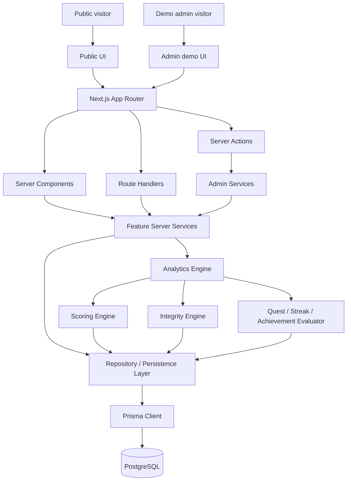

# PerpArena Architecture

PerpArena is a Next.js App Router application with feature-oriented server
boundaries and deterministic domain engines.

## System Diagram

## Layers

- `src/app`: Next.js routes, layouts, route handlers, and server actions.
- `src/components`: reusable layout and UI primitives.
- `src/features`: feature modules for competitions, traders, analytics,
  scoring, integrity, engagement, admin, simulation, and health.
- `src/lib`: environment, API helpers, configuration, and database utilities.
- `prisma`: PostgreSQL schema and migrations.
- `scripts`: explicit operational scripts for simulation and recalculation.
- `docs`: methodology and operational documentation.

## Server Boundaries

Public data flows through Server Components and explicit server services.
Client Components are used for interaction such as navigation toggles, tabs,
wallet copy behavior, admin form state, and charts.

Route handlers exist only where useful:

- public health/readiness
- public leaderboard summary
- public trader summary
- admin export
- guarded demo recalculation

## Domain Engines

Analytics, scoring, integrity, and engagement logic are deterministic and kept
separate from UI rendering. Financial calculations are rounded only at
presentation boundaries.

## Persistence

PostgreSQL is the only supported database. There is no fallback to files,
memory, SQLite, or mock persistence when `DATABASE_URL` is absent or
unreachable.

## Admin Model

The admin area is a demonstration control center. Production write behavior is
disabled by default and should not be treated as complete production
authentication.

## Deployment Assumptions

The app requires:

- Next.js-compatible hosting
- PostgreSQL
- Prisma migrations
- explicit synthetic seed approval
- verified public URL before claiming deployment success
